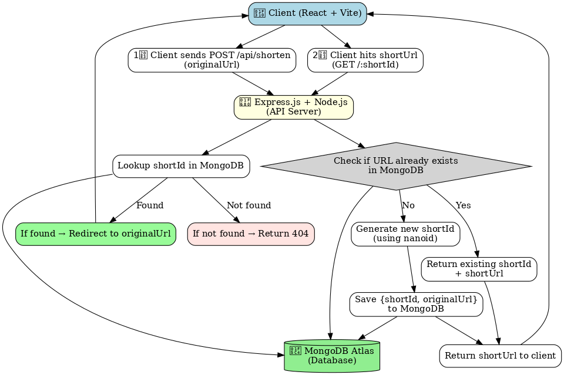

PathCut = URL- Shortner app

This app allows users to convert long, hard-to-share links into short and easy-to-remember URLs.

- Features

Shorten any valid URL into a unique short code

Redirect to the original URL via short code

Health check endpoint with database connection status

MongoDB backend for persistence

CORS-enabled API for frontend usage

Built with TypeScript for type-safety

- Architecture Overview

The system follows this flow:

A client submits a long URL.

The API (Express server) receives the request at the "shorten URL" endpoint.

The server validates the URL format.

MongoDB stores the record, including the original URL, the generated short code, and metadata such as creation date and click count.

The server responds with the newly created shortened URL.

When the user visits the shortened link, the server looks up the short code in MongoDB and redirects to the original URL.

here is the flowchart image for all the operations i am doing in the pathcut



## ✨ Features

- 🔗 Shorten any valid URL into a unique short code  
- 🔁 Redirect to the original URL via the short code  
- 🩺 Health-check endpoint for database connection status  
- 💾 Persistent storage using MongoDB  
- 🔒 CORS-enabled API for frontend usage  
- 🕒 Track URL creation date and click count  
- 🧠 Fully typed with TypeScript for safety and clarity  

---

## 🧱 Technology Stack

| Layer | Technology |
|-------|-------------|
| Frontend | Vite + TypeScript + HTML + CSS |
| Backend | Node.js + Express |
| Database | MongoDB (Mongoose ODM) |
| Hosting | Vercel (Frontend + API) |
| Environment | dotenv for configuration |
| Version Control | Git + GitHub |

---

## 🗂️ Project Structure

URL-Shortner/
├── .env
├── .env.example
├── .gitignore
├── eslint.config.js
├── index.html
├── package.json
├── package-lock.json
├── tsconfig.app.json
├── tsconfig.json
├── tsconfig.node.json
├── vite.config.ts
├── url_shortener_mongodb_flowchart.png
└── src/
├── server/
│ ├── app.ts # Express app initialization
│ ├── routes/
│ │ └── urlRoutes.ts # API routes for URL operations
│ ├── models/
│ │ └── Url.ts # Mongoose schema/model
│ └── controllers/
│ └── urlController.ts # Logic for shortening, redirecting, health check
├── client/
│ ├── main.tsx # React/Vite entry point
│ ├── components/ # Reusable UI components
│ └── pages/ # UI screens for Home, About, etc.
└── styles/ # CSS/SCSS files

yaml
Copy code

---

## 🏗️ Architecture Overview

The system follows this flow:

1. A client submits a **long URL** through the frontend.
2. The **API (Express server)** receives the request at the `/shorten` endpoint.
3. The server **validates** the URL format.
4. **MongoDB** stores the record — original URL, generated short code, creation date, and click count.
5. The API responds with the **shortened URL** (e.g., `https://pathcut.vercel.app/abc123`).
6. When users visit the short link, the server finds the original URL in MongoDB and **redirects** them there.


---

## 🧩 API Endpoints

### 🔹 1. Shorten URL  
**POST** `/api/shorten`  
**Request Body:**
```json
{
  "longUrl": "https://example.com/very/long/link"
}
Response:

json
Copy code
{
  "shortUrl": "https://pathcut.vercel.app/abc123",
  "shortCode": "abc123",
  "createdAt": "2025-11-10T10:00:00Z"
}
🔹 2. Redirect to Original URL
GET /:shortCode
Redirects to the original long URL if the code exists.

🔹 3. Health Check
GET /api/health
Response:

json
Copy code
{
  "status": "ok",
  "database": "connected"
}
⚙️ Environment Variables
Create a .env file in the root directory:

env
Copy code
PORT=5000
MONGODB_URI=mongodb+srv://<username>:<password>@cluster.mongodb.net/pathcut
BASE_URL=https://path-cut.vercel.app
Example file: .env.example (already included in the repo)

💻 Setup and Installation
1️⃣ Clone the repository
bash
Copy code
git clone https://github.com/yourusername/PathCut.git
cd PathCut
2️⃣ Install dependencies
bash
Copy code
npm install
3️⃣ Setup environment
Copy .env.example → .env and update MongoDB credentials.

4️⃣ Run the development server
bash
Copy code
npm run dev
Frontend runs at: http://localhost:5173
API runs at: http://localhost:5000

🏗️ Build for Production
bash
Copy code
npm run build
npm start
This compiles both frontend (Vite) and backend (Express) for deployment.

🚀 Deployment
Frontend: Deploy on Vercel

Backend/API: Either deploy on Vercel serverless functions or Render

Database: Use MongoDB Atlas for cloud database hosting

Make sure to set your environment variables in your hosting provider’s dashboard.

🔮 Future Improvements
📊 Add click analytics and charts for tracking URL usage

🔐 Add authentication and user dashboard

📱 Create a responsive mobile interface

🧠 Implement custom short codes

🧾 Add QR code generation for shortened URLs
