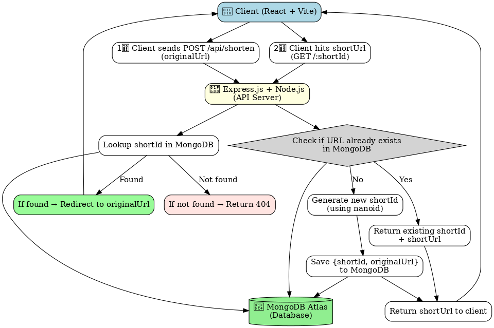

# PathCut URL Shortener

PathCut converts long URLs into short, shareable links and redirects users back to the original destination.

## Features

- Shorten valid URLs into unique short codes.
- Redirect short links to original URLs.
- Track click count per short URL.
- Health check endpoint (`/api/ping`) with MongoDB connection state.
- Admin endpoint (`/api/admin/urls`) to list stored URLs.
- CORS support for local development and deployed frontend.
- Resilient local development behavior:
  - Frontend API calls use timeout handling and clear error messages.
  - Backend starts even if MongoDB is unavailable.
  - In development, backend can use an in-memory fallback store when MongoDB is down.

## Tech Stack

- Frontend: React + TypeScript + Vite
- Backend: Express + TypeScript
- Database: MongoDB (Mongoose)

## Environment Variables

Create a `.env` file in project root:

```env
MONGO_URI=your_mongodb_connection_string
DB_NAME=urlshortener
PORT=5000
BASE_URL=http://localhost:5000
VITE_API_URL=http://localhost:5000
# Optional: force in-memory fallback
# USE_IN_MEMORY_STORE=true
```

Notes:

- `VITE_API_URL` is used by the frontend for API requests.
- `BASE_URL` is used as fallback, but API responses now prefer the current request host/protocol.
- In-memory fallback is enabled by default in non-production mode.

## Run Locally

1. Install dependencies:

```bash
npm install
```

2. Start backend:

```bash
npm run dev:server
```

3. Start frontend:

```bash
npm run dev
```

<<<<<<< HEAD


## ✨ Features

- 🔗 Shorten any valid URL into a unique short code  
- 🔁 Redirect to the original URL via the short code  
- 🩺 Health-check endpoint for database connection status  
- 💾 Persistent storage using MongoDB  
- 🔒 CORS-enabled API for frontend usage  
- 🕒 Track URL creation date and click count  
- 🧠 Fully typed with TypeScript for safety and clarity  

---

## 🧱 Technology Stack

| Layer | Technology |
|-------|-------------|
| Frontend | Vite + TypeScript + HTML + CSS |
| Backend | Node.js + Express |
| Database | MongoDB (Mongoose ODM) |
| Hosting | Vercel (Frontend + API) |
| Environment | dotenv for configuration |
| Version Control | Git + GitHub |

---

## 🗂️ Project Structure

URL-Shortner/
├── .env
├── .env.example
├── .gitignore
├── eslint.config.js
├── index.html
├── package.json
├── package-lock.json
├── tsconfig.app.json
├── tsconfig.json
├── tsconfig.node.json
├── vite.config.ts
├── url_shortener_mongodb_flowchart.png
└── src/
├── server/
│ ├── app.ts # Express app initialization
│ ├── routes/
│ │ └── urlRoutes.ts # API routes for URL operations
│ ├── models/
│ │ └── Url.ts # Mongoose schema/model
│ └── controllers/
│ └── urlController.ts # Logic for shortening, redirecting, health check
├── client/
│ ├── main.tsx # React/Vite entry point
│ ├── components/ # Reusable UI components
│ └── pages/ # UI screens for Home, About, etc.
└── styles/ # CSS/SCSS files

yaml
Copy code

---

## 🏗️ Architecture Overview

The system follows this flow:

1. A client submits a **long URL** through the frontend.
2. The **API (Express server)** receives the request at the `/shorten` endpoint.
3. The server **validates** the URL format.
4. **MongoDB** stores the record — original URL, generated short code, creation date, and click count.
5. The API responds with the **shortened URL** (e.g., `https://pathcut.vercel.app/abc123`).
6. When users visit the short link, the server finds the original URL in MongoDB and **redirects** them there.

## 🧩 API Endpoints

### 🔹 1. Shorten URL  
**POST** `/api/shorten`  
**Request Body:**
```json
{
  "longUrl": "https://example.com/very/long/link"
}
Response:

json
Copy code
{
  "shortUrl": "https://pathcut.vercel.app/abc123",
  "shortCode": "abc123",
  "createdAt": "2025-11-10T10:00:00Z"
}
🔹 2. Redirect to Original URL
GET /:shortCode
Redirects to the original long URL if the code exists.

🔹 3. Health Check
GET /api/health
Response:

json
Copy code
{
  "status": "ok",
  "database": "connected"
}
⚙️ Environment Variables
Create a .env file in the root directory:

env
Copy code
PORT=5000
MONGODB_URI=mongodb+srv://<username>:<password>@cluster.mongodb.net/pathcut
BASE_URL=https://path-cut.vercel.app
Example file: .env.example (already included in the repo)

💻 Setup and Installation
1️⃣ Clone the repository
bash
Copy code
git clone https://github.com/yourusername/PathCut.git
cd PathCut
2️⃣ Install dependencies
bash
Copy code
npm install
3️⃣ Setup environment
Copy .env.example → .env and update MongoDB credentials.

4️⃣ Run the development server
bash
Copy code
npm run dev
Frontend runs at: http://localhost:5173
API runs at: http://localhost:5000

🏗️ Build for Production
bash
Copy code
npm run build
npm start
This compiles both frontend (Vite) and backend (Express) for deployment.

🚀 Deployment
Frontend: Deploy on Vercel

Backend/API: Either deploy on Vercel serverless functions or Render

Database: Use MongoDB Atlas for cloud database hosting

Make sure to set your environment variables in your hosting provider’s dashboard.

🔮 Future Improvements
📊 Add click analytics and charts for tracking URL usage

🔐 Add authentication and user dashboard

📱 Create a responsive mobile interface

🧠 Implement custom short codes

🧾 Add QR code generation for shortened URLs
=======
If `npm` is unavailable in your shell, you can run binaries directly:

```bash
node -r ts-node/register/transpile-only src/api/server.ts
node ./node_modules/vite/bin/vite.js
```

## API Endpoints

- `POST /api/shorten`
  - Body: `{ "longUrl": "https://example.com/very/long/url" }`
- `GET /api/admin/urls`
- `GET /api/ping`
- `GET /:shortCode`

## Behavior When MongoDB Is Down

- Server still listens on `PORT` (no connection-refused from backend startup failure).
- In development mode, URL operations use in-memory storage fallback.
- In production mode (without fallback), DB-backed routes return `503` with clear error JSON.
- In-memory records are temporary and reset when server restarts.

## Troubleshooting

### Frontend shows `ERR_CONNECTION_REFUSED` for `localhost:5000`

Cause: backend is not running on port `5000`.

Checks:

```bash
curl http://127.0.0.1:5000/api/ping
```

If this fails, start backend again.

### Backend logs MongoDB/Atlas connection errors

Likely causes:

- Current IP is not whitelisted in MongoDB Atlas Network Access.
- Invalid `MONGO_URI`.

Quick fix for local testing:

- Keep backend running and use development in-memory fallback.

Permanent fix:

- Add your current IP (or temporary `0.0.0.0/0`) in Atlas Network Access.
- Verify `MONGO_URI` and restart backend.

## Architecture Flow

1. User submits long URL from frontend.
2. Backend validates and generates short code.
3. Data is stored in MongoDB (or in-memory fallback in local/dev failure mode).
4. Backend returns `shortUrl`.
5. Visiting the short URL redirects to the original URL and increments click count.

Flowchart:


>>>>>>> 4257e0e (fixed the post error and also fixed the admin page)
